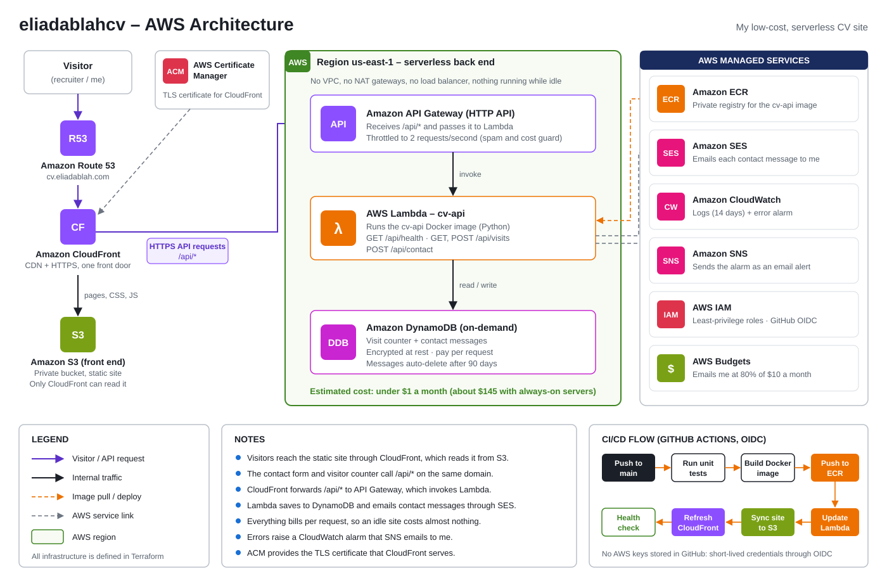

# eliadablahcv

Built and owned by **Elikem Adablah** · © 2026, all rights reserved.

This is my CV website and the AWS setup that runs it. I built it with
Terraform, Docker, Python and GitHub Actions.

My goal was simple: run a real website on AWS, the right way, for almost no
money. The usual setup with always-on servers costs about $145 a month. Mine
costs under $1 a month, because every part only charges me when someone uses it.

**It is live: https://cv.eliadablah.com**

## What my site does

- **Shows my CV.** One page with my skills, jobs and projects.
- **Takes inquiries.** A visitor fills in a form (name, email, company, phone,
  reason, message). I save it and get it as an email.
- **Counts visitors.** The bottom of the page shows how many visits I've had.
- **Answers questions.** A small chat box answers common questions about me.

## How it works



In plain words:

1. You type `cv.eliadablah.com`. **Route 53** points you to **CloudFront**.
2. **CloudFront** gets my page from a private **S3** bucket and sends it to you over HTTPS.
3. When you send the form, your browser calls `/api/contact`.
4. **CloudFront** passes that to **API Gateway**, which runs my code on **Lambda**.
5. My code saves your inquiry in **DynamoDB** and emails it to me with **SES**.
6. If my code breaks, **CloudWatch** notices and **SNS** emails me.

## Why I built it this way

| What I needed | The always-on way | What I used | Why |
|---|---|---|---|
| Show the pages | S3 + CloudFront | S3 + CloudFront | Already cheap |
| Run my code | ECS Fargate, 2 containers | Lambda running my Docker image | Free when nobody visits |
| Take in requests | Load balancer | API Gateway | No hourly fee |
| Private network | VPC + 2 NAT gateways | Not needed | NAT gateways cost the most |
| Database | RDS PostgreSQL + a copy | DynamoDB, pay per request | No hourly fee |
| Store my image | ECR | ECR | Same |
| Send email | SES | SES | Same |
| Alerts | CloudWatch + SNS | CloudWatch + SNS | Same |
| Stop spam | WAF firewall | Speed limit + a hidden spam trap | WAF has a monthly fee |
| Watch my bill | Nothing | AWS Budgets email at $8 | So I never get a surprise |

The always-on way is what I learned in my DevOps class (UTrains), and it is the
right choice for a busy app. For a personal site it is too much, so I
redesigned it.

## What it costs

These are my estimates for a small personal site in us-east-1.

| Part | Each month |
|---|---|
| Route 53 (my domain's DNS, which I already had) | $0.50 |
| S3, CloudFront, Lambda, API Gateway, DynamoDB, SES, SNS | $0 to a few cents |
| ECR image storage | a few cents |
| CloudWatch logs and 1 alarm | $0 to a few cents |
| **Total** | **under $1** |

## How I keep it safe

- **The S3 bucket is private.** Only CloudFront can read it.
- **Least privilege.** My Lambda can only use its own table, its own logs and my one email address.
- **No AWS keys in GitHub.** My pipeline logs in with OIDC and gets a pass that lasts one deploy.
- **The form is checked twice.** Once in the browser, and again in my API.
- **Spam trap and speed limit.** Bots that fill in a hidden box are ignored, and the API only takes about 2 requests a second.
- **I don't keep data forever.** Inquiries are deleted after 90 days.

## What is in each folder

```text
frontend/               My site: index.html, styles.css, js/
backend/                My API: Python code, Dockerfile, tests
terraform/              Everything I create on AWS
.github/workflows/      My deploy pipeline
docs/                   My diagram and my deploy guide
github-pages-redirect/  A page that sends my old site to the new one
```

## Try it

**See the site.** Open `frontend/index.html` in a browser. The form and the
counter need my API, so they only work once the site is on AWS.

**Run my tests.** They use a fake database and a fake mailer, so no AWS
account is needed.

```bash
cd backend
python -m unittest discover -s tests -t .
```

**Put it on AWS.** My step-by-step guide is in [docs/DEPLOY.md](docs/DEPLOY.md).

## What I learned

- How to pick AWS services by cost, not just by what is popular.
- How to write all my infrastructure as code with Terraform, so I can build it
  or delete it with one command.
- How to pack an API into a Docker image and run it on Lambda.
- How to build a pipeline that tests, builds and deploys on every push.
- How to give each part only the permissions it needs.
